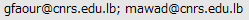

# gmlb20: Global Map Lebanon 2.0
## non-commercial use

## commercial use
 

## note
Credit: "Global Map of Lebanon © ISCGM/National Council for Scientific Research - Remote Sensing Center"

Contact: National Council for Scientific Research - Remote Sensing Center.

E-mail: 

URL: www.cnrs.edu.lb
